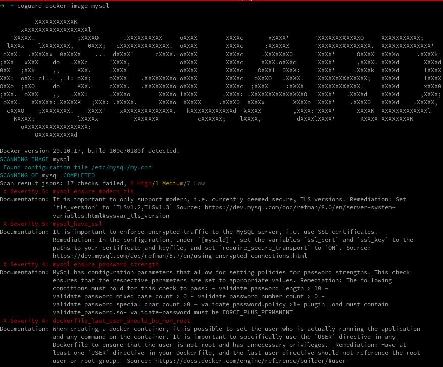

# CoGuard

CoGuard is a comprehensive static analysis tool for IT infrastructure
configurations (cloud and on-premise).

Finding and
fixing misconfigurations and security vulnerabilities for IaC, devices,
containers, cloud settings, and applications. Reduce the noise of CVE
notifications and focus on small improvements for big wins.

## Table of Contents

- [CoGuard](#coguard)
  - [Table of Contents](#table-of-contents)
  - [Why CoGuard](#why-coguard)
  - [Overview](#overview)
  - [CoGuard CLI install instructions](#coguard-cli-install-instructions)
    - [Prerequisites](#prerequisites)
  - [Install the CLI](#install-the-cli)
    - [Supported Methods](#supported-methods)
      - [pip](#pip)
  - [ Troubleshooting](#-troubleshooting)
    - [Make sure that Docker is running locally](#make-sure-that-docker-is-running-locally)
    - [`pip` not included in the PATH](#pip-not-included-in-the-path)
    - [Windows users and symbolic links](#windows-users-and-symbolic-links)
  - [Usage](#usage)
    - [Scanning Docker images](#scanning-docker-images)
    - [Scanning project repository folders](#scanning-project-repository-folders)
    - [Extracting and scanning cloud configurations (BETA)](#extracting-and-scanning-cloud-configurations-beta)
    - [General scan](#general-scan)
    - [Inclusion into CI/CD pipeline](#inclusion-into-cicd-pipeline)
  - [Screenshot](#screenshot)
  - [Security Benchmarks in CoGuard](#security-benchmarks-in-coguard)
  - [Supported Technologies and Roadmap](#supported-technologies-and-roadmap)
  - [Learn more](#learn-more)

## <a id="why-coguard"></a>Why CoGuard

Infrastructure as Code (IaC) is here to stay. The versioning and
continuous scanning of every layer of your IT (on premise and cloud)
infrastructure is crucial.

CoGuard's team observed that there are a lot of policy checks on the layers
communicating to the cloud, but the configurations inside specific
compute devices such as physical servers, virtual machines or
containers are mostly neglected, or have silo-ed solutions at best.

In order to have static analysis practices for IaC that go as deep as
the available tools for code, every layer needs to be equally addressed.

In our practice, we observed that, at times, even an awareness of
locations of configuration files is lacking. This is why we created a
command line tool helping with discovering those configurations, and
scanning them.

CoGuard's CLI combines multiple ways to extract and scan your configuration
files.

1. Docker images: Modern
   container scanners check for versions of software and libraries
   installed on those containers, and establish if there are common known
   vulnerabilities and exposures (CVEs). The
   CoGuard CLI is trying to find known configuration files for e.g. web
   servers or databases, and scans these for security and best practice.
   Additionally, the last Docker file used to create an image is analyzed
   as well.
2. Project Repositories: Modern projects store their infrastructure
   information inside code repositories for better visibility and
   traceability. CoGuard can extract Infrastructure as Code (IaC)
   files and other supported configurations. It also searches for
   external container references and scans these as well.
3. Cloud configurations not represented as IaC: Many organizations
   have either not yet started using IaC tools, or have a hybrid model
   of part IaC, part manual management. For these cases, we can
   extract cloud configurations for AWS, Azure or GCP, and scan them
   as well.

## <a id="introduction"></a>Overview

This project is the command line interface to CoGuard. 

The current release discovers configuration files in:

1. project folders (such as GitHub Repositories) and
2. Docker images and their contents,
3. cloud configurations extracted from the AWS, Azure and GCP using their respective CLIs.

CoGuard CLI is used to search the local file system for known 
[configuration files](#supported-technologies). CoGuard CLI can also extract the cloud
configurations from AWS, Azure and GCP using their respective CLI your credentials. The
configuration files are stored in ./.coguard 


## <a id="installation"></a>CoGuard CLI install instructions


### <a id="pre-requisites"></a>Prerequisites

* [Python3](https://www.python.org/downloads/)
* [pip](https://pip.pypa.io/en/stable/installation/)
* [Docker](https://docker.com/)
* [CoGuard account](https://coguard.io/signup)

The CoGuard CLI requires `python3`, `pip3` and `docker` installed on your system.

Platform specific `python3` and `pip3` instructions:
<details>
<summary>Mac OS</summary>
<a id="macos-install"></a>Using <a href="https://brew.sh">Homebrew</a>, run the following:

```shell
brew install python3
```
</details>
<details>
<summary>Windows</summary>

<a id="windows-install"></a>Download Python3 for Windows using [this link](https://www.python.org/downloads/windows/), and
install it.

</details>

<details>
<summary>Ubuntu/Debian</summary>

```shell
sudo apt install -y python3 python3-pip
```
</details>

<details>
<summary>Alpine</summary>

```shell
apk add python3 py3-pip
```
</details>

<details>
<summary>CentOS/Fedora</summary>

```shell
sudo yum install -y python3 python3-pip
```
</details>

<details>
<summary>Arch Linux</summary>

```shell
sudo pacman -S python python-pip
```
</details>


## <a id="installation-instructions"></a>Install the CLI 

### Supported Methods

#### pip

To install the CoGuard CLI can be installed using `pip`. 

```shell
pip3 install coguard-cli
```

Once the CLI is successfully installed, you can use the `coguard` command from your terminal.
The `coguard` CLI provides access to CoGuard's range of commands and functionalities. 

The CoGuard CLI can be pulled from this repository and used
directly. 


## <a id="troubleshooting"></a> Troubleshooting

### Make sure that Docker is running locally

In order for `coguard` CLI to operate properly, users are required to have 
[Docker](https://docker.com/) installed and running locally.

### `pip` not included in the PATH

It may happen that the folder where `pip` is installing packages is not
in included in `PATH`. We have observed it on some Ubuntu installations, and on
Homebrew Mac installs. For the Linux case, such as Ubuntu,
you can find the binary usually under `$HOME/.local/bin/coguard`, i.e. you run
```shell
$HOME/.local/bin/coguard docker-image [<YOUR-IMAGE-NAME-OR-ID>]
```
For the Mac case, it is often installed under `~/Library/Python/<YOUR_PYTHON_VERSION>/bin/coguard`, i.e. you would run
```shell
~/Library/Python/<YOUR_PYTHON_VERSION>/bin/coguard docker-image [<YOUR-IMAGE-NAME-OR-ID>]
```

If you omit the image ID parameter, CoGuard will scan all the images currently
stored on your device.

### Windows users and symbolic links

Windows users need to be allowed to create and read symbolic links.
This can be achieved using three options:
<details>
<summary>Option 1 - Run as Administrator</summary>
1. Run the CoGuard execution as admin temporarily. This can be achieved by opening the
   PowerShell or command prompt as administrative user (right click on the icon),
   or by issuing the command
   ```shell
   Start-Process powershell -Verb runAs
   ```
   inside an already open command/Powershell window.
</details>
<details>
<summary>Option 2 - Run in Developer Mode</summary>
1. Run Windows in Developer Mode (instructions on how to run Windows as a developer can
   be found [here](https://docs.microsoft.com/en-us/gaming/game-bar/guide/developer-mode)).
</details>
<details>
<summary>Option 3 - WSL and Docker</summary>
1. Run CoGuard on a Linux virtual machine, e.g. using the Windows subsystem for Linux.
   This is commonly installed with Docker Desktop for Windows. If you do not have it installed,
   then installation instructions can be found
   [here](https://docs.microsoft.com/en-us/windows/wsl/install).
   The installation steps for CoGuard using WSL are equivalent to the pre-requisites
   and installation steps described for Linux (dependent on the distribution you choose).
</details>


## <a id="usage"></a>Usage

Any of the following options requires you to create a CoGuard account.
After completion, this image check will return the findings of CoGuard
on this particular image. You can view the latest historical scan results
when logging in to [https://portal.coguard.io](https://portal.coguard.io).


The following commands exist within the `coguard` command:

* `docker-image` : scans a Docker image 
* `folder` : find configuration files in a local folder and scan the files
* `cloud` : extract a cloud snapshot as Terraform files and scan the Terraform files
* `pipeline` : generate files for use in a specified CI/CD pipeline
* `scan` : scan everything using default parameters


### <a id="docker-scan"></a>Scanning Docker images

Using the CoGuard CLI, you can run a scan on your local Docker images
using

```shell
coguard docker-image [scan] [<YOUR-IMAGE-NAME-OR-ID>]
```

### <a id="repo-scan"></a>Scanning project repository folders

Using the CoGuard CLI, you can run a scan on your local
file repositories using

```shell
coguard folder [scan] [<PATH-TO-FOLDER>]
```

### <a id="cloud-scan"></a>Extracting and scanning cloud configurations (BETA)

Using the CoGuard CLI, you can run a scan a current snapshot of your
cloud configurations. This requires you to have the respective
cloud CLI tools (`aws-cli` for AWS, `gcloud` for GCP or `az` for
Azure) installed and authenticated on your device.

```shell
coguard cloud [scan] {aws, azure, gcp}
```

The extraction time may vary. Depending on the complexity of the configuration and 
speed of your internet connection. CoGuard will timeout after 120 minutes. 

### <a id="general-scan"></a>General scan

To get a general scan, which includes all locally installed Docker
images, anything in the current-working directory (recursive) and any
installed cloud provider authentication, simply run

```shell
coguard scan
```

### <a id="add-to-cicd-pipeline"></a>Inclusion into CI/CD pipeline

CoGuard can be included as a step in your CI/CD pipeline. CoGuard generates the
necessary templates and scripts.

GitHub Actions is available in the current release. To generate e.g. a GitHub Actions
YAML which automatically scans your repository on
pull request/push, simply type

```shell
coguard pipeline github add <PATH_TO_YOUR_REPOSITORY>
```
[Future support is planned](#support-roadmap) for GitLab CI/CD, Jenkins, Bamboo, CircleCI, etc.

## Screenshot



Screenshot of a sample scan. CoGuard also analyzes the last Dockerfile used.

## Security Benchmarks in CoGuard

The checks are gathered from different security benchmarks, such as CIS, but also
directly from the user manuals of these software projects. At times, known issues for
certain versions and security remediations specific to a certain version are being taken
into account as well.


## <a id="supported-technologies"></a>Supported Technologies and Roadmap

CoGuard currently supports the the auto-discovery of configuration files inside
Docker containers, folders and cloud configuration exports. The full list of configurations files
can be found
[in this folder](https://github.com/coguardio/coguard-cli/tree/master/src/coguard_cli/discovery/config_file_finders).

- Supported Applications &amp; Infrastructure as Code
    - Apache Kafka
    - Apache Tomcat
    - Apache WebServer
    - CloudFormation
    - Dockerfile
    - ElasticSearch
    - Helm
    - Kerberos
    - Kubernetes
    - MongoDB
    - MySQL
    - Netlify
    - NGINX
    - OpenTelemetry Collector
    - PostgreSQL
    - Redis
    - TerraForm
- Supported Cloud Hosts
    - AWS
    - Azure
    - GCP
    - OVH Cloud
- <a id="supported-roadmap"></a>Roadmap (Future Support Planned)
    - Ansible
    - Jenkins
    - Bamboo
    - CircleCI
    - OpenAPI
    - Puppet
    - BitBucket Pipelines
    - [Contact us](https://coguard.io/contact) for full list or to add a specific request or custom rules

This list
will expand in the future. In addition, we are scanning the
Dockerfile used to create the images, and will add some Linux
configuration files in the near future.

## <a id="learn-more"></a>Learn more

- [CoGuard](https://www.coguard.io)
- [Blog](https://www.coguard.io/blog)
- [Contact Us](https://coguard.io/contact)

