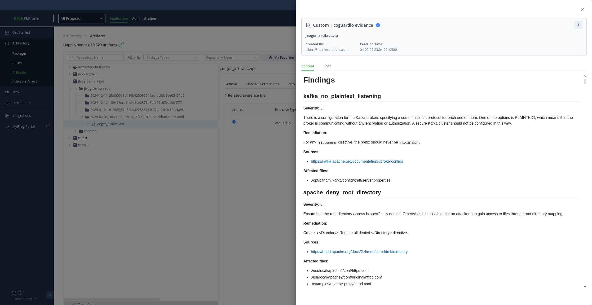

# CoGuard JFrog integration

## Overview

CoGuard integrates seamlessly with JFrog's [evidence
endpoint](https://jfrog.com/blog/evidence-collection-with-jfrog/),
enabling scanning of artifacts, builds, packages, and Release Bundles.
This flags misconfigurations at all layers of the infrastructure, at all
stages in your software development lifecycle.

The CoGuard scan ensures that no infrastructure and deployment related
misconfigurations are making it to production uncaught or untraced.

## Prerequisites

To enable this integration, ensure the following:

- JFrog Cloud Enterprise+ Subscription with enabled evidence feature:
  The evidence feature is
  currently available exclusively for JFrog Cloud Enterprise+
  subscription holders.
- Set up a key pair for signing the evidence as stated
  [in this instruction manual](https://github.com/jfrog/Evidence-Examples).
- A valid CoGuard Enterprise subscription.

## How It Works

CoGuard and JFrog are designed to be included in your CI/CD pipeline. This can
be achieved via a simple bash script, or the domain specific language of your
CI/CD tool.

Asides from setting up the [JFrog CLI](https://github.com/marketplace/actions/setup-jfrog-cli)
and the [CoGuard CLI](https://github.com/marketplace/actions/coguard-scan-action),
there are three steps involved for your pipeline script.

1. Perform the JFrog action (artifact/build upload, package or release build).
2. CoGuard Scanning: CoGuard performs in-depth scans of your artifact,
   repository, build, package or release bundle. This will produce a JSON and
   optionally a Markdown file which can be used for the next step.
3. Attach the JSON and the Markdown file as evidence to your JFrog action and
   upload it to your JFrog instance.

Here is a simple example for a docker image scan:

```yaml
name: CoGuard build docker image and scan it with CoGuard
run-name: Pull request ${{github.event.number}} with cli is being scanned for misconfigs for a built docker-image

# For demo-purposes: on-dispatch
on:
  workflow_dispatch:

env:
  JFROG_URL: https://coguardio.jfrog.io

permissions:
  checks: read
  contents: read
  pull-requests: read
  statuses: read

jobs:
  run_coguard_check_docker:
    timeout-minutes: 10
    runs-on: ubuntu-latest
    steps:
      - uses: actions/checkout@b4ffde65f46336ab88eb53be808477a3936bae11
        with:
          submodules: true

      - name: Setting up Jfrog
        if: always()
        uses: jfrog/setup-jfrog-cli@v4
        env:
          JF_URL: ${{ env.JFROG_URL }}
          JF_ACCESS_TOKEN: ${{ secrets.JF_ACCESS_TOKEN }}
      - name: Build, tag, and push image to JFrog Instance
        run: |
            docker build -t <IMAGE_NAME>:<IMAGE_TAG> .
            jf docker push <YOUR_ORG_INSTANCE>.jfrog.io/<YOUR_REPO>/<IMAGE_NAME>:<IMAGE_TAG>
      - name: Run the CoGuard CLI Action
        uses: coguardio/coguard-scan-action@0.2.46.3
        with:
          username: ${{ secrets.COGUARD_USERNAME }}
          password: ${{ secrets.COGUARD_PASSWORD }}
          outputFormat: json,markdown
          repositoryScan: false
          dockerImageName: <IMAGE_NAME>:<IMAGE_TAG>
      - name: Upload CoGuard Evidence to JFrog
        if: always()
        run: |
          jf evd create \
          --package-name coguard-cli \
          --package-version ${{ env.CURRENT_COGUARD_VERSION }} \
          --package-repo-name docker-trial \
          --markdown result.md \
          --key ./private_key.pem --key-alias ${{ secrets.JF_KEY_ALIAS }} \
          --predicate result.json \
          --predicate-type https://www.coguard.io/schema-v1
```

More examples for such CI/CD pipeline scripts can be found [here](./jfrog_examples).

The evidence will then be displayed in the portal.


## Features

## Integration Features

### JFrog manages your artifacts and lifecycle, CoGuard provides evidence about your configuration

JFrog is the leading platform provider for DevOps and artifact management. Combined
with CoGuard’s scanning capabilities, development teams can ensure secure and
scalable infrastructure configurations by using this integration.

### Repository types supported

As of today, the following repository types can be scanned via CoGuard.

- Terraform Modules
- Images in JFrog Docker repositories
- Generic Repositories
- HELM Charts

### Accellerate changes in your infrastructure and tools

Infrastructure changes, compared to code changes, happen at a much
slower pace in most organizations. The reason is the uncertainty of
the impact. With the CoGuard integration, any issues caused by a
configuration change will be captured, allowing your teams to deploy
with confidence.  CoGuard also allows its users to easily create
custom policies, both for third party software and for the
configuration of their own proprietary software.  In this way,
vioations against documented best practices are captured alongside of
misconfigurations of third party dependencies.

### Collect evidence in SARIF format

While CoGuard has its own JSON schema to present its results in, it allows
for a direct export into the standardized SARIF format, which can then be
utilized by other downstream tools for data collection and visualization.

## FAQs

## JFrog was already scanning my IaC files through X-Ray. How does this integration extend the current capabilities?

While the current scanning capabilities capture CVEs and IaC misconfigurations,
this extension allows to also detect misconfigurations for software commonly deployed
in your infrastructure (Postgres, Kafka, Hadoop, Cassandra, MongoDB, Redis, etc.).

## The adoption of IaC tools is not that far yet in our organization. Can we still benefit from this integration?

CoGuard can extract your current configurations from your cloud
environment, and the CLI can even find configurations within your
running servers and containers. This allows you to already have the
visibility into your infrastructure security posture, while enabling
you to move towards an automated, infrastructure as code environment.

## How much extra time does the scan require in my CI/CD pipeline?

The average scan is done in 30s or less. Cloud snapshot extractions
and scans depend on the number of different resources you have running
on the cloud, but average out to take 20 minutes.

## The initial examples are using GitHub Actions. Is there support for other CI/CD tooling?

The evidence uploads can be performed on any other common CI/CD
platform, such as Jenkins, Bitbucket pipelines, CircleCI, etc. Our
team is happy to help you get set up.

## Get Started

Start leveraging CoGuard’s powerful scanning capabilities in
conjunction with JFrog’s evidence feature today.
[Contact us](mailto:info@coguard.io) to get
started.
